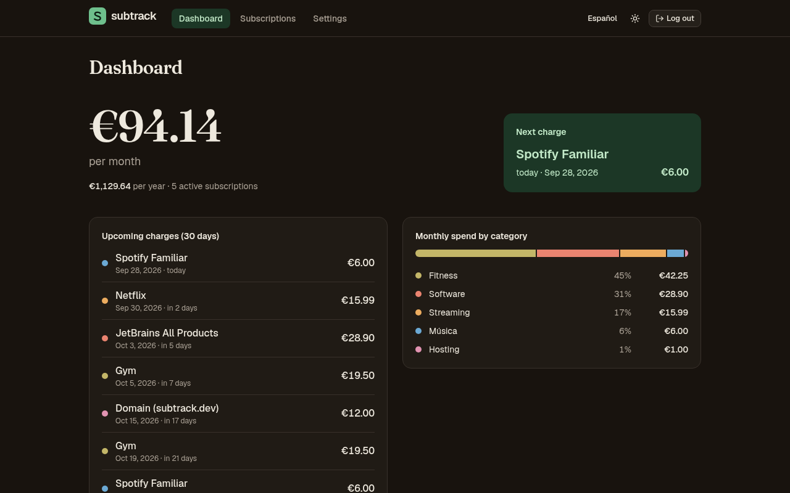

# subtrack

[](https://github.com/pichaDev/subtrack/actions/workflows/ci.yml)

*[Read in English](README.md)*

App web autoalojada para controlar tus suscripciones: cuánto gastas al mes y al año, qué se cobra pronto y en qué categorías se va el dinero.


## Funciones

- Suscripciones que se cobran cada N días, semanas, meses o años; el próximo cobro se calcula a partir de cualquier fecha de cobro conocida (sin desfases a fin de mes).
- Suscripciones compartidas: pones el precio total y entre cuántas personas se paga, y los totales solo cuentan tu parte.
- Panel con el gasto mensual y anual, los cobros de los próximos 30 días y el gasto por categoría.
- Categorías y métodos de pago editables.
- Interfaz en español e inglés, con tema claro y oscuro (sigue al sistema y tiene un botón para cambiarlo).
- Una sola cuenta con login por sesión; funciona como una única imagen Docker junto a PostgreSQL.




## Stack

Java 25 · Spring Boot 4 (Web MVC, Data JPA, Security, Validation) · PostgreSQL 18 + Flyway · React 19 + TypeScript · Vite · TanStack Query · React Router · Tailwind CSS + shadcn/ui · react-i18next · JUnit + Testcontainers · Vitest + Testing Library + MSW · Docker Compose · GitHub Actions

## Arrancarlo con Docker

```bash
cp .env.example .env
# genera el hash de la contraseña y pégalo en .env, entre comillas simples
docker run --rm httpd:2.4-alpine htpasswd -bnBC 10 "" 'tu-contraseña' | tr -d ':\n'
docker compose up -d --build
```

Abre http://localhost:8080 y entra con `SUBTRACK_USERNAME` y tu contraseña. Los datos se guardan en el volumen `db-data`.

## Desarrollo

Necesitas JDK 25, Node 24 y Docker (para Testcontainers).

```bash
# backend en :8080, con un Postgres desechable que arranca Testcontainers
cd backend
SUBTRACK_USERNAME=admin SUBTRACK_PASSWORD_HASH='<hash>' ./mvnw spring-boot:test-run

# frontend en :5173, con proxy de /api al backend
cd frontend
npm install
npm run dev
```

Tests: `./mvnw verify` en `backend/` y `npm test` en `frontend/`.

## API

Todo va bajo `/api` y necesita sesión, salvo el login.

| Método | Ruta | |
| :--- | :--- | :--- |
| `POST` | `/api/auth/login` | formulario `username`, `password` → 204 / 401 |
| `POST` | `/api/auth/logout` | 204 |
| `GET` | `/api/auth/me` | usuario actual |
| `GET` `POST` | `/api/subscriptions` | listar / crear |
| `GET` `PUT` `DELETE` | `/api/subscriptions/{id}` | leer / reemplazar / borrar |
| `GET` `POST` | `/api/categories`, `/api/payment-methods` | listar / crear |
| `PUT` `DELETE` | `/api/categories/{id}`, `/api/payment-methods/{id}` | renombrar / borrar |
| `GET` | `/api/dashboard` | totales, próximos cobros y gasto por categoría |

Las peticiones que modifican datos llevan la cabecera `X-XSRF-TOKEN` con el valor de la cookie `XSRF-TOKEN`. Los errores siguen [RFC 9457](https://www.rfc-editor.org/rfc/rfc9457) (Problem Details), con los errores de campo en `errors: [{field, code}]`.

## Licencia

[GPL-3.0](LICENSE)
