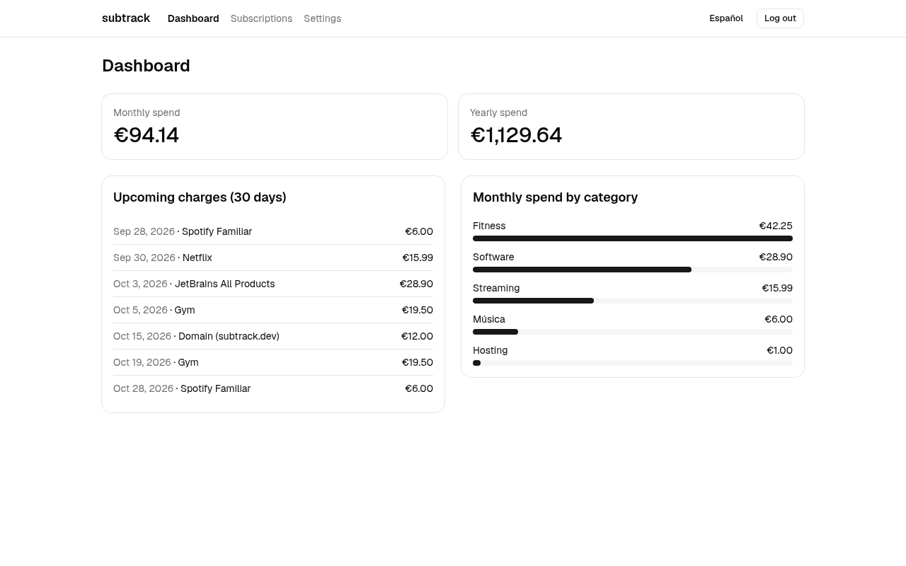
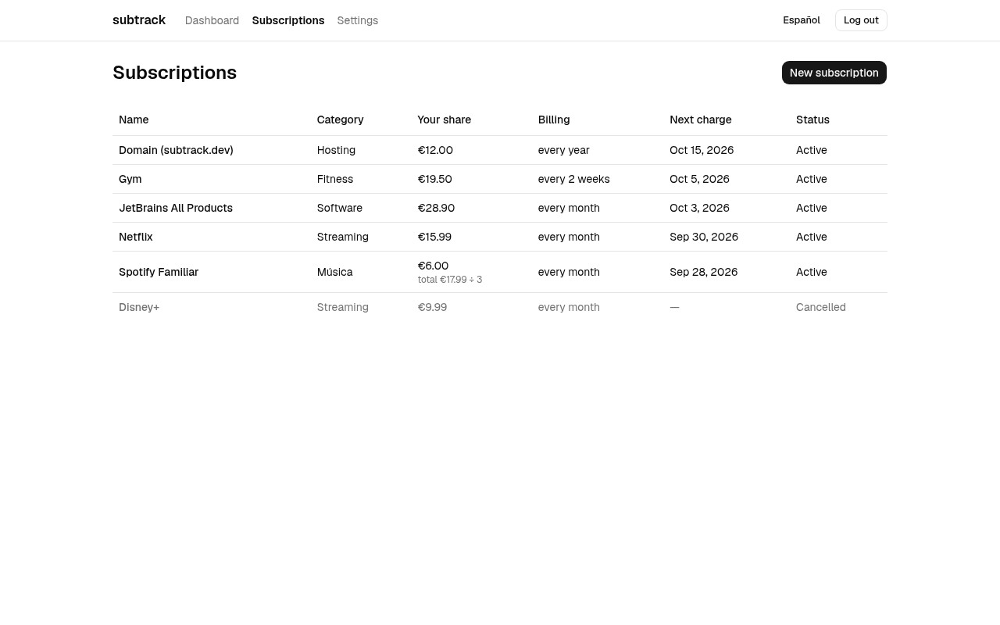

# subtrack

[](https://github.com/pichaDev/subtrack/actions/workflows/ci.yml)

*[Leer en español](README.es.md)*

Self-hosted web app to keep track of your subscriptions: how much you spend per month and per year, what is charged next, and where the money goes by category.



## Features

- Subscriptions billed every N days, weeks, months or years; the next charge date is computed from any known charge date (no month-end drift).
- Shared subscriptions: enter the total price and how many people share it — totals only count your part.
- Dashboard with monthly and yearly spend, charges due in the next 30 days and spend by category.
- Editable categories and payment methods.
- English and Spanish interface.
- Single account, session login, runs as one Docker image next to PostgreSQL.



## Stack

Java 25 · Spring Boot 4 (Web MVC, Data JPA, Security, Validation) · PostgreSQL 18 + Flyway · React 19 + TypeScript · Vite · TanStack Query · React Router · Tailwind CSS + shadcn/ui · react-i18next · JUnit + Testcontainers · Vitest + Testing Library + MSW · Docker Compose · GitHub Actions

## Run it with Docker

```bash
cp .env.example .env
# generate the password hash and paste it into .env, between single quotes
docker run --rm httpd:2.4-alpine htpasswd -bnBC 10 "" 'your-password' | tr -d ':\n'
docker compose up -d --build
```

Open http://localhost:8080 and sign in with `SUBTRACK_USERNAME` and your password. Data lives in the `db-data` volume.

## Development

Requirements: JDK 25, Node 24, Docker (for Testcontainers).

```bash
# backend on :8080, with a throwaway Postgres started by Testcontainers
cd backend
SUBTRACK_USERNAME=admin SUBTRACK_PASSWORD_HASH='<hash>' ./mvnw spring-boot:test-run

# frontend on :5173, proxying /api to the backend
cd frontend
npm install
npm run dev
```

Tests: `./mvnw verify` in `backend/`, `npm test` in `frontend/`.

## API

All endpoints are under `/api` and need a session, except login.

| Method | Path | |
| :--- | :--- | :--- |
| `POST` | `/api/auth/login` | form `username`, `password` → 204 / 401 |
| `POST` | `/api/auth/logout` | 204 |
| `GET` | `/api/auth/me` | current user |
| `GET` `POST` | `/api/subscriptions` | list / create |
| `GET` `PUT` `DELETE` | `/api/subscriptions/{id}` | read / replace / delete |
| `GET` `POST` | `/api/categories`, `/api/payment-methods` | list / create |
| `PUT` `DELETE` | `/api/categories/{id}`, `/api/payment-methods/{id}` | rename / delete |
| `GET` | `/api/dashboard` | totals, upcoming charges, spend by category |

Write requests need the `X-XSRF-TOKEN` header with the value of the `XSRF-TOKEN` cookie. Errors are [RFC 9457](https://www.rfc-editor.org/rfc/rfc9457) problem details with field errors in `errors: [{field, code}]`.
